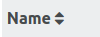

# Overview

Some experiments with a table component in Angular.

# Paging

## The Pagination Component

The template has the following structure:

~~~html
<!-- show component if there are more than one page: -->
<nav aria-label="Page navigation example" *ngIf="hasMoreThanOnePage()">
    <ul class="pagination">
        <!-- disable the arrow if there is no previous page-->
        <li class="page-item" [class.disabled]="!hasPreviousPage()">
            <!-- role="button" make mouse cursor to a pointer -->
            

                &laquo;
                Previous
            

        </li>
        <!-- hide the lower number if ther is no previous page-->
        <li class="page-item" *ngIf="hasPreviousPage()">
            
{{currentPage - 1}}

        </li>
        <li class="page-item active">
            <!-- current selected page:  not clickable -->
            
{{currentPage}}

        </li>
        <li class="page-item" *ngIf="hasNextPage()">
            
{{currentPage + 1}}

        </li>

        <li class="page-item" [class.disabled]="!hasNextPage()">
            

                &raquo;
                Next
            

        </li>
    </ul>
</nav>
~~~

The css is from bootstrap 4 (<https://v4-alpha.getbootstrap.com/components/pagination/>)

~~~typescript
export class PaginatorAsViewChild<T>  {
  // Can be set via "linesPerPage" attribute in element. If not, default (10) is used.
  @Input() linesPerPage = 10;
  
  private _currentPage = 1;

  // all data: needed for calculating page data.
  private data: T[] = [];

  // data of current page
  private pageData: T[] = [];

  constructor() { }

  get currentPage(): number {
    return this._currentPage;
  }

  setData(data: T[]): void {
    this.data = data || [];
    this.recalculatePages();
  }

  getPageData(): T[] {
    return this.pageData;
  }

  public nextPage(): void {
    if (this.hasNextPage()) {
      this._currentPage++;
      this.recalculatePages();
    }
  }

  public previousPage(): void {
    if (this.hasPreviousPage) {
      this._currentPage--;
      this.recalculatePages();
    }
  }

  hasNextPage(): boolean {
    return (this._currentPage) * this.linesPerPage < this.data.length;
  }

  hasPreviousPage(): boolean {
    return this._currentPage > 1;
  }

  hasMoreThanOnePage(): boolean {
    return this.data.length / this.linesPerPage > 1;
  }

  gotoPage(page: number): void {
    // pages up to this page filled with data: (page -1)* linesPerPage data elements available, therefore:
    if (page > 0 && (page - 1) * this.linesPerPage < this.data.length) {
      this._currentPage = page;
      this.recalculatePages();
    }
  }

  private recalculatePages() {
    // extracts the data of the current page to show.
    this.pageData = this.data.slice((this._currentPage - 1) * this.linesPerPage, this._currentPage * this.linesPerPage);
  }
}

~~~

Note that most actions require a call to `recalculatePages()`.

## Use the Pagination Component in a Component with a Table

The `PaginatorAsViewChild` is used a a `ViewChild` of the parent component. The reason for this is the two way communication between them. Angular injects the first child of the type due to the `@ViewChild(PaginatorAsViewChild)` annotation. 

~~~typescript
  @ViewChild(PaginatorAsViewChild)
  private paginatorComponent: PaginatorAsViewChild<WaterLevel>;
~~~

The `PaginatorAsViewChild` holds the data which should be shown on in the table. Therefore we use a get method which delegates to the `PaginatorAsViewChild`:

~~~typescript
 get pageElements(): WaterLevel[] {
    // the current page elements are stored in the paginator component.
    if (this.paginatorComponent) {
      return this.paginatorComponent.getPageData();
    } else {
      return [];
    }
  }
~~~
 
The input data can be set at the right place, like the `ngAfterViewInit` method:
 
~~~typescript
  ...
  const inputData = ....
  this.paginatorComponent.setData(inputData);
  ...
~~~

It is important to respect the Angular lifecycle and the point of time when Angular injects the view child. Before the injection the view child field (`this.paginatorComponent`) is simply null.

# Sorting

## Overview

By clicking on the table head, the rows should be sorted accoring to the data in the selected column.

## The Table Sorter Component

The sorter "button" is a simple span element with some enhancements:

~~~html

<!-- Transclusion using ng-content -->
 <ng-content></ng-content>
  <i class="fa"  aria-hidden="true"
    [class.fa-sort-asc]="ascending && active"
    [class.fa-sort-desc]="!ascending && active" 
    [class.fa-sort]="!active"></i>

~~~
Here we use the `[role="button"] { cursor: pointer;}` property of bootstrap.
The Angular class binding (<https://angular.io/docs/ts/latest/guide/template-syntax.html#!#other-bindings>) sets different font awesome classes depending on the component properties `ascending` and `active`. 

If there is a click on the element, the on `(click)="switchSortOrder()` event binding calls the `switchSortOrder()` method of the component. 

~~~typescript
export class TableSorterComponent implements OnInit {

  /**
   * The object property path which is used for sorting. Can be nested path.
   */
  @Input('property')
  property: string;

  /**
   * Indicates whether the initial sorting should be done with this instance.
   */
  @Input('initialActive')
  initialActive = false;

  active = false;
  ascending = true;

  constructor(private eventService: TableSorterEventService) {
    // if another sorter was activated, this one should be deactivated.
    // This can be checked by comparing the property to sort:
    eventService.subscribe(e => this.active = e.property === this.property);
  }

  ngOnInit(): void {
    if (this.initialActive) {
      // triggers the initial sorting
      this.postEvent();
    }
  }

  switchSortOrder(): void {
    this.ascending = !this.ascending;
    this.postEvent();
  }

  private postEvent(): void {
    this.eventService.post(
      new TableSortChangeEvent(this.property,
        // the compare function to use for sorting.
        PoaUtils.withAscending(this.ascending, PoaUtils.getComparator(this.property))));
  }
}
~~~

## The TableSorterEventService

The comunication between the various `TableSorterComponent` instances and the host component is realized by a simple event service which is based on RxJs `Subject`: 

~~~typescript
@Injectable()
export class TableSorterEventService {

  private readonly subject = new Subject<TableSortChangeEvent>();
  constructor() {
  }

  subscribe(subscriber: (value: TableSortChangeEvent) => void) {
    return this.subject
      .subscribe(subscriber);
  }

  post(event: TableSortChangeEvent) {
    this.subject.next(event);
  }
}

export class TableSortChangeEvent {

  /**
   * The compareFunction is used to sort the data.
   */
  constructor(public readonly property: string, public readonly compareFunction: (a: any, b: any) => number) {

  }
}
~~~

Note that the `TableSortChangeEvent` has a function type property which is used as compare function when sorting the data.

## Use Table Sorter Component in a Component with a Table

~~~html
<table class="table  table-striped table-hover table-sm">
    <thead class="thead-default">
        <tr class="row">
          <!--  set the column width fixed. Has to be done also in the tbody area? -->
            <th class="col-sm-5">
                <poa-table-sorter property="longname">Name</poa-table-sorter>
            </th>
           ...
      </tr>
    </thead>
    <tbody>
        <tr *ngFor="let station of data" class="row">
            <td class="col-sm-5">{{station.longname}}</td>
            ,,,
        </tr>
    </tbody>
</table>
~~~

~~~typescript
@Component({
  ...
  providers: [TableSorterEventService]
})
export class StationsTableComponent {

  data: Station[] = [];
  
  private compareFunction: (a: Station, b: Station) => number;

  constructor(route: ActivatedRoute, eventService: TableSorterEventService) {
    // get resolved data via subscription
    route.data.subscribe((data: { stations: Station[] }) => {
      // We do change the array, therefore copy it in other not change the original array
      this.data = data.stations.slice(0);
      this.sortInputData();
    });
  
    // listen to changes in the TableSorterComponents: 
    eventService.subscribe(e => {
      this.compareFunction = e.compareFunction;
      this.sortData();
    });
  }
  
  private sortData(): void {
    if (this.compareFunction) {
      this.data.sort(this.compareFunction);
    }
  }
}
~~~

# References
* <https://v4-alpha.getbootstrap.com/>
* <http://fontawesome.io/>
* <https://angular.io/docs/ts/latest/guide/template-syntax.html#!#other-bindings>
