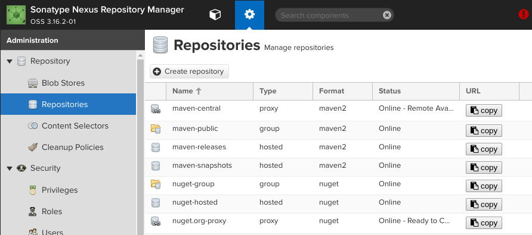

# Übersicht

# Setup

`docker-compose.yml`
~~~yml
nexus:
    image: sonatype/nexus3
    volumes:
      - "nexus3-data:/sonatype-work"
    ports:
      - "8081:8081"
volumes:
  nexus3-data:
~~~

Hinweis: Volumes befinden sich unter `/var/lib/docker/volumes`.

# Konfiguration

## Repositories
{:height="300px" }

Details zum group Repository "maven-public" findet man in 
<https://help.sonatype.com/repomanager3/configuration/repository-management#RepositoryManagement-RepositoryGroup>. Dieses Repository 
wird als zentrales Maven Repository inklusive Mirror für Maven Central verwendet.

## User

TODO: jenkins-user

# Referenzen

* <https://hub.docker.com/r/sonatype/nexus3/>
* <https://help.sonatype.com/repomanager3/>  
* <https://help.sonatype.com/repomanager3/configuration/repository-management>  