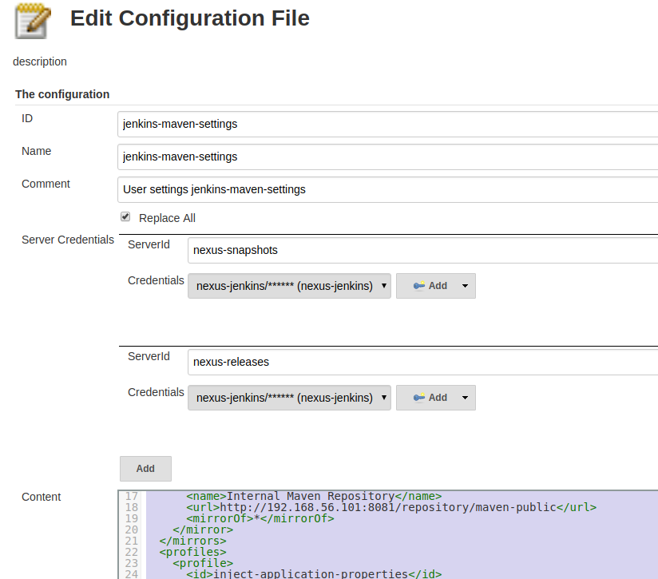

# Übersicht

* Maven basierte Java Projekte sollten gebaut werden.
* Kodanalyse mit Sonar
* Deployment der erzeugten Artefakte in ein Nexus Repository     

{: .info title="Primäres Build Tool"}
Maven ist das primäre Build-Tool. Es sollte möglich sein, ein Artefakt nur mit Maven vollständig zu bauen. 

# Voraussetzung

Installierte Plugins

* Config File Provider Plugin:  <https://wiki.jenkins.io/display/JENKINS/Config+File+Provider+Plugin>
  * Damit wird via settings.xml maven konfiguriert
    * Zugangsdaten für Nexus server
    * Diverse Konfigurations-Properties  
  * Anlegen von Konfigurationsfiles über "Manage Jenkins" -> "Manage Files"
  
( * Pipeline Maven Plugin: <https://wiki.jenkins.io/display/JENKINS/Pipeline+Maven+Plugin> )

# Konfiguration Config File Provider  

## Maven settings.xml

{: .code title="settings.xml für Config File Provider" .x}
~~~xml
<settings>
  <servers>
    <!-- Ersetzt durch Credential Konfiguration-->
    <server>
      <id>nexus-snapshots</id>
      <username>to be replaced</username>
      <password>to be replaced</password>
    </server>
    <server>
      <id>nexus-releases</id>
      <username>to be replaced</username>
      <password>to be replaced</password>
    </server>
  </servers>

  <!--  -->
  <mirrors>
    <mirror>
      <id>internal-repository</id>
      <name>Internal Maven Repository</name>
      <url>http://192.168.56.101:8081/repository/maven-public</url>
      <mirrorOf>*</mirrorOf>
    </mirror>
  </mirrors>
  <profiles>
    <profile>
      <id>inject-application-properties</id>
      <properties>
        <!-- see https://docs.sonarqube.org/display/SCAN/Analyzing+with+SonarQube+Scanner+for+Maven -->
        <sonar.host.url>http://192.168.56.101:9000</sonar.host.url>
        <!-- URLs fur Distributionmanagement-->
        <altSnapshotDeploymentRepository>nexus-snapshots::http://192.168.56.101:8081/repository/maven-snapshots</altSnapshotDeploymentRepository>
        <altReleaseDeploymentRepository>nexus-releases::http://192.168.56.101:8081/repository/maven-releases</altReleaseDeploymentRepository>
      </properties>
    </profile>
  </profiles>
 
  <activeProfiles>
    <activeProfile>inject-application-properties</activeProfile>
  </activeProfiles>
</settings>
~~~ 

{: .info title="Hinweis"}
Eine ähnliche `settings.xml` Datei wird vom Entwickler benutzt. Diese wird üblicherweise in `<user_home>/.m2` abgelegt.

### Mirror Konfiguration
* Zentraler Mirror für alle Maven Repositories

### Properties Konfiguration
* Properties für Server URLs

## Server Credentials

Die Konfiguration von Server Credentials wird in <https://wiki.jenkins.io/display/JENKINS/Config+File+Provider+Plugin#ConfigFileProviderPlugin-MavenServerCredentials(since2.7)> 
beschrieben. Wie übernehmen die Credentials für Repository Server `nexus-releases` und `nexus-snapshots`.

{:height="300px" }

# Jenkinsfile

{: .info title="Jenkins File Stages und Maven Lifecycle Phases"}
Maven hat einen definierten Build Lifecycle mit mehreren Phasen, siehe
<https://maven.apache.org/guides/introduction/introduction-to-the-lifecycle.html>. Man könnte nun im Jenkinsfile mit Stages 
wie "Build", "Test", "Deploy" diese Lifecycle zum Teil nachbauen. Dabei ist aber zu berücksichtigen, dass bei maven Aufrufen 
wie zum Beispiel `mvn test` der Maven Lifecycle bis zur angegebenen Phase durchgeführt wird und nicht nur die angegebene.  
(siehe z.B. <https://stackoverflow.com/questions/55183989/maven-lifecycle-within-jenkins-pipeline-how-to-best-separate-responsibilities>). 

## Allgemein

Maven als docker agent (<https://jenkins.io/doc/book/pipeline/syntax/#agent>):

~~~
agent {
  docker {
    image 'maven:3-alpine'
    args '-v /root/.m2:/root/.m2 --network=host'
  }
}
~~~

### Docker Maven Images
Findet man unter <https://hub.docker.com/_/maven/>.

### Weiterführende Dokumentation 
* <https://jenkins.io/doc/book/pipeline/docker/>
* <https://jenkins.io/doc/book/pipeline/syntax/#agent/>

## Build Stage
~~~
stage('Maven: clean deploy') {
  steps {
    configFileProvider([configFile(fileId: 'jenkins-maven-settings', variable: 'MAVEN_SETTINGS')]) {
      sh 'mvn fr.jcgay.maven.plugins:buildplan-maven-plugin:list-phase   -Dbuildplan.tasks=clean,deploy'
      sh 'mvn -s $MAVEN_SETTINGS clean deploy'
    }
  }
  post {
    always {
      junit allowEmptyResults: true, testResults: 'target/surefire-reports/*.xml' 
    }
  }
}  
~~~

Hinweise: 
* Beim Anlegen der Konfigurationsdatei wurde die ID "jenkins-maven-settings" gesetzt.
* `post`: <https://jenkins.io/doc/book/pipeline/syntax/#post>  
* `junit`: Archive JUnit-formatted test results: (<http://192.168.56.101:8080/job/io.github.leoniedermeier.jenkins.demo/pipeline-syntax/html>)
* Das Maven Pipeline Plugin wird nicht benutzt, falls man es doch benutzen will, sollte man berücksichtigen:
  * Nur bei `mavenSettingsConfig` werden credentials ersetzt, bei `globalMavenSettingsConfig` nicht 
  * Unter `withMaven` besonderer Aufruf von Maven, z.B. mit `$MVN_CMD` (<https://github.com/jenkinsci/pipeline-maven-plugin/blob/master/jenkins-plugin/src/resources/faq.md#how-to-use-the-pipeline-maven-plugin-with-docker-since-version-303>)
  * Vgl. Dokumentation zu `withMaven` und was alles gemacht wird (<https://wiki.jenkins.io/display/JENKINS/Pipeline+Maven+Plugin>).

### Sonar Analysis

* <https://docs.sonarqube.org/display/SCAN/Analyzing+with+SonarQube+Scanner+for+Maven>
* Die Sonar Host URL ist in `settings.xml` via der Property `sonar.host.url` konfiguriert 

{: .code title="settings.xml für Config File Provider und Benutzer"}
~~~xml
<sonar.host.url>http://192.168.56.101:9000</sonar.host.url>
~~~

Sonar Analysis sollte während der verify-Phase von Maven laufen. Dazu ergänzt man in `pom.xml`:
{: .code title="pom.xml"}
~~~
<plugin>
  <groupId>org.sonarsource.scanner.maven</groupId>
  <artifactId>sonar-maven-plugin</artifactId>
  <version>3.6.0.1398</version>
  <executions>
    <execution>
      <phase>verify</phase>
      <goals>
        <goal>sonar</goal>
      </goals>
    </execution>
  </executions>
</plugin>
~~~

### Deplyment in Artefakt Repository

{: .info title="Hinweis"}
Nur Artefakte, die mittels eines Jenkins Buildes erzeugt wurden, sollten in Artefakt Repository abgelegt werden. 

Maven deploy benötigt konfigurierte `distributionManagement` elemente im `pom.xml` (<https://maven.apache.org/pom.html#Distribution_Management>) 
oder alternative Repository Konfigurationsproperties (<https://maven.apache.org/plugins/maven-deploy-plugin/deploy-mojo.html>). 
Da nur Jenkins in die Artefakt Repositores deployen kann, werden die alternativen Repository Properties in `settings.xml` des Config 
File Provider definiert (siehe oben):

{: .code title="settings.xml für Config File Provider"}
~~~xml
<altSnapshotDeploymentRepository>nexus-snapshots::http://192.168.56.101:8081/repository/maven-snapshots</altSnapshotDeploymentRepository>
<altReleaseDeploymentRepository>nexus-releases::http://192.168.56.101:8081/repository/maven-releases</altReleaseDeploymentRepository>
~~~

Das Maven deploy Plugin muss mindestens die Version 2.8 haben. Dazu wird im `pluginManagement` des `pom.xml` ein entsprechender 
Eintrag ergänzt: 
{: .code title="pom.xml"}
~~~xml
<plugin>
  <groupId>org.apache.maven.plugins</groupId>
  <artifactId>maven-deploy-plugin</artifactId>
  <version>3.0.0-M1</version>
</plugin>
~~~

# TODO

* Lib wie <https://github.com/apache/maven-jenkins-lib/blob/master/vars/asfMavenTlpStdBuild.groovy>
  
# Referenzen
* <https://wiki.jenkins.io/display/JENKINS/Pipeline+Maven+Plugin>
* <https://github.com/jenkinsci/pipeline-maven-plugin/blob/master/jenkins-plugin/src/resources/faq.md#how-to-use-the-pipeline-maven-plugin-with-docker-since-version-303>