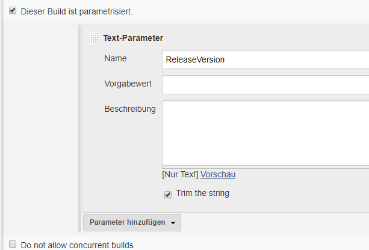
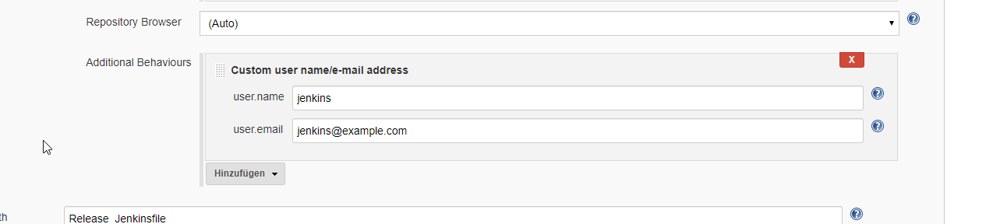

# Übersicht

Ein "Release" Build entspricht im Wesentlichen einem Snapshit-Build. Unterschied ist:

* Build hat eine Nummer und keine Suffix "-SNAPSHOT"
* Tag im Git Repository
* Artefakte werden in das Release Artefakt Repository deployed  

Ein Release Build wird als Pipeline angelegt. Die zu verwendende Release Version kann über den Parameter `ReleaseVersion` eingegeben 
werden. Dazu wird dieser in der Konfguration angelegt. 

{:height="300px" }

# Jenkinsfile

Schritte:

* Taggen im lokalen Git Repository
* Maven build inklusive Deployment in das Artefakt Repository
* Pushen des Tags in Upstream Git Repository
  

{: .code title="Jenkinsfile für Release Build" .x}
~~~
 pipeline {
  agent any 
  options {
    skipStagesAfterUnstable()
  }
  
  stages {
    stage('Clone') {
      steps {
        checkout scm
      }
    }
    stage('Tag') {
      steps {
        sh "git tag -a release-${ReleaseVersion} -m \"Release ${ReleaseVersion}\""  
      }
    }
    stage('Maven: clean deploy') {
      agent {
        docker {
          image 'maven:3-alpine'
          args '-v /root/.m2:/root/.m2 --network=host '
        }
      }
      steps {
        configFileProvider([configFile(fileId: 'jenkins-maven-settings', variable: 'MAVEN_SETTINGS')]) {
          sh "mvn -s ${MAVEN_SETTINGS}  fr.jcgay.maven.plugins:buildplan-maven-plugin:list-phase   -Dbuildplan.tasks=clean,deploy"
          // Mit CI fiendly versions:
          sh "mvn -s ${MAVEN_SETTINGS} -Drevision=${ReleaseVersion} clean deploy"
        }
      }
      post {
        always {
          junit allowEmptyResults: true, testResults: 'target/surefire-reports/*.xml' 
        }
      }
    }
    stage('push tag') {
      steps {
         //  https://issues.jenkins-ci.org/browse/JENKINS-28335
          sh 'git config --local credential.helper "! echo username=\\$GIT_USERNAME; echo password=\\$GIT_PASSWORD;"'
          withCredentials([usernamePassword(credentialsId: 'git-pass-credentials-ID', passwordVariable: 'GIT_PASSWORD', usernameVariable: 'GIT_USERNAME')]) {
            sh "git push origin release-${ReleaseVersion}"
        }
      }
      post {
        always {
          sh 'git config --local --unset credential.helper'
        }
      }
    }  
  }
}

~~~   

* Der `agent` docker "maven:3-alpine" wird nur für `stage` Maven Build verwendet. Dieser agent hat u.a. kein git installiert, 
so dass Aufrufe der Art ` sh "git ..."` nicht funktionieren
*  Für den Aufruf werden gegebenenfalls username und user.email benötigt. Diese werden via "Additional Behaviours" in "SCM" 
Bereich 
konfiguriert: 
{:height="300px" }
* Um einen frischen Git-Stand zu haben wird in "Additional Behaviours" in "SCM"  konfiguriert: "Wipe out repository & force clone" 
(alternativ wäre "Clean before checkout", das ist aber schwächer - Repository wird beibehalten)
* "git-pass-credentials-ID": wird als Credential für den Git Zugriff auf das Remote Repository benötigt und den Jenkins Credentials 
konfiguriert. 
  * Speziell falls git Shell Kommandos Username und Password benötigen:  Username und Password werden mit Hilfe eines git credential helpers (<https://git-scm.com/docs/gitcredentials>) 
weitergereicht. `sh 'git config --local credential.helper "! echo username=\\$GIT_USERNAME; echo password=\\$GIT_PASSWORD;"'`  Die 
Variablen `GIT_USERNAME` und `GIT_PASSWORD` werden mit `withCredentials([usernamePassword(credentialsId: 'git-pass-credentials-ID', passwordVariable: 'GIT_PASSWORD', usernameVariable: 'GIT_USERNAME')]) 
...` gefüllt.

{: .info title="Kein neuer Commit"}
Da die Maven Version des Projektes CI-friendly ist (<https://maven.apache.org/maven-ci-friendly.html>), wird durch das setzen 
einer konkreten Version **kein** neuer Commit erzeugt (der Quellkode wird nicht verändert). Es wird lediglich ein Tag auf einen 
vorhandenen Commit gesetzt.

# Referenzen
