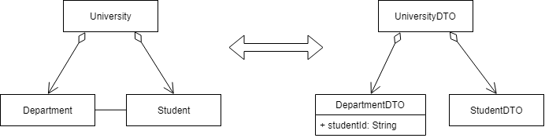

# Overview

The model has associations, which should not be assotionations in the DTOs. Rather, the associations are replaced by id fields.

Example: 

{: .code title="Example Model Classes"}
~~~
 class University {
    List<Department> departments = new ArrayList<Department>();
    List<Student> students = new ArrayList<Student>();
}

class Department {
    List<Student> students = new ArrayList<Student>();
}

class Student {
    String id;
}
~~~

{: .code title="Example DTO Classes"}
~~~
 class UniversityDTO {
    List<DepartmentDTO> departments = new ArrayList<DepartmentDTO>();
    List<StudentDTO> students = new ArrayList<StudentDTO>();
}

class DepartmentDTO {
    List<String> studentIds = new ArrayList<String>();
}

class StudentDTO {
    String id;
}
~~~
Getters and Setters are omitted.

Note the difference between the `students` / `studentIds` field type of `Department` and `DepartmentDTO`.

# Implementation

## Mapping from Model to DTO

The mapping between DTO and  model is straightforward. When the name of the fields in DTO and model are the same, a conversion 
is needed.

If the referenced class (for instance `Student` above) implements an interface like `Identifiable`
~~~java
interface Identifiable {
  String getId();
}
~~~
the conversion can be a general method like:
~~~java
String toId(Identifiable identifiable) {
    return identifiable.getId();
}
~~~ 
This method is automatically applied by mapstruct, if the names of the fields in source and target classes are the same.

## Mapping from Model to DTO

The mapping from DTO to model is a bit more difficult. The task is to find or create a suitable instance of the model object 
for a given id value in the DTO. 

### Cache Created Model Instances

In order to have access to instances of model objects, we store them in a map. The key is the id value. This can easily realized 
by an after-mapping method like:
~~~java
@AfterMapping
void registerInstance(DTO dto, @MappingTarget MODEL model) {
    // store the model in a map
}
~~~

### Resolve the References

Resolving references from a given key is similar to  what "Object Factories" <http://mapstruct.org/documentation/stable/reference/html/#object-factories> 
do. But we have to take in to account, that when using an object factory, the instance for the key has to be available. This 
means, that it has to be mapped before. But this can not be guaranteed. Therefore object factories can not be used.

#### The ReferenceResolver Class

The `ReferenceResolver` does

* store the created model object instances
* hold a list of references to resolve
* resolve the references

{: .code .x title="Simple ReferenceResolver Implementation"}
~~~java
public class ReferenceResolver {

    private static class ReferenceTarget {
        private final Object key;
        private final Consumer<Object> setter;
        public ReferenceTarget(Object key, Consumer<Object> setter) {
            this.key = key;
            this.setter = setter;
        }
    }

    private final Map<Object, Object> instances = new HashMap<>();

    private final List<ReferenceTarget> referenceTargets = new ArrayList<>();

    public void registerInstance(Object key, Object value) {
        instances.put(key, value);
    }

    public void registerRefereceTarget(Object key, Consumer<Object> setter) {
        referenceTargets.add(new ReferenceTarget(key, setter));
    }
    
    public void resolveReferences() {
        for (ReferenceTarget referenceTarget : referenceTargets) {
            Object object = instances.get(referenceTarget.key);
            referenceTarget.setter.accept(object);
        }
    }
}
~~~

In order to store the created model object instances, the above mentioned `registerInstance` looks like:
~~~java
@AfterMapping
void registerInstance(DTO dto, @MappingTarget MODEL model) {
    referenceResolver.registerInstance(dto.getId(), model);
}
~~~
This method can be used in a generic way.

Filling the list with references to resolve can not be generic. For the example above, it will look like: 
~~~java
@AfterMapping
void afterFromDTO(DTO departmentDTO, @MappingTarget Department department) {
    departmentDTO.getStudents()
                    .forEach(s -> referenceResolver.registerUnresolvedReference(s, department::addStudent));
}
~~~

#### Execution of Mapping

The `ReferenceResolver` method `resolveReferences()` resolves the references. It has to be invoked after mapping the whole 
object structure from DOT to model.

~~~java
ReferenceResolver referenceResolver = ...
// provide the ReferenceResolver to the mapping (see below)
University result = UniversityMapper.INSTANCE.fromDTO(inputDTO);
referenceResolver.resolveReferences();
~~~

#### Providing the ReferenceResolver
 An instance of `ReferenceResolver` has to be provided to the mapper methods. This can be done for instance by

* passing a context object (see <http://mapstruct.org/documentation/stable/reference/html/#passing-context>)
* use a `java.lang.ThreadLocal` 

# References
* <http://mapstruct.org/>