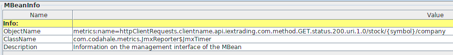

# Spring MVC Metrics

Über die Klasse `WebMvcMetricsConfiguration` wird ein `MetricsHandlerInterceptor` erzeugt und als Interceptor zu den Handlern hinzugefügt (siehe auch `DispatcherServlet`, `HandlerExecutionChain`). Zu allen request-Methoden wird also eine Metrik erzeugt.

Die Metrik hat u.a. folgende Tags:

* Request Methode, z.B: GET
* Request URI (templated if possible).
* Klassenname der Exception, wenn eine geworfen wurde
* Response Status 

Bei Export über JMX werden die Tags zum Objektnamen hinzugefügt:

# Metrics bei `RestTemplate`

Über die Klassen `RestTemplateMetricsConfiguration`, `MetricsRestTemplateCustomizer` wird ein `MetricsClientHttpRequestInterceptor` zum `RestTemplate` hinzugefügt. 

# References

* <https://docs.spring.io/spring-boot/docs/2.0.0.BUILD-SNAPSHOT/reference/htmlsingle/#production-ready-metrics>
* <http://micrometer.io/>
