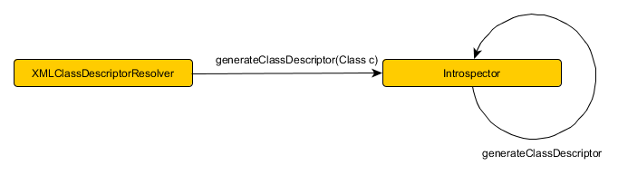
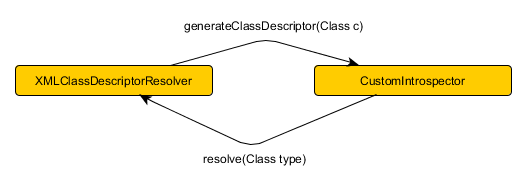

# Übersicht

Das Mapping von Klassen auf XML kann in Castor u.a. mit

* Mapping Dateien  
> "In mapping mode, the user provides Castor XML with a user-defined mapping (in form of a mapping file) that allows 
the (partial) definition of a customized mapping between Java classes (and their properties) and XML."  
(Castor Doku, http://castor.codehaus.org/xml-framework.html#Mapping-mode)

* Introspection 
> "In introspection mode, Castor XML uses Java reflection to establish the binding between the Java classes 
(and their properties) and the XML, ..."  
(Castor Doku, http://castor.codehaus.org/xml-framework.html#Introspection-mode)

Hat man eine Klassenhierarchie so kann immer nur ein Mode benutzt werden, z.B.:

* Basisklasse "Super" , hat Mapping Datei
* Subklasse "Sub_1" (extends Super), hat Mappingdatei (mit  Sub_1 extends Super in der Konfiguration)
* Subklasse "Sub_2" (extends Super), hat keine Mappingdatei

Beim Marshalling passiert nun folgendes:

* Sub_1 wird über Mappingdatei gemarshalled. Der Anteil von Super ans Sub_1 wird über die Mappingdatei von Super gemarshalled
* Sub_2 wird komplett über Introspection gemarshalled, auch der Anteil von Super an Sub_2, Mappingdatei von Super spielt 
keine Rolle

 

Hat man viele Klassen für das Marshalling und diese Klassen haben eine oder mehrere gemeinsame Basisklassen, 
so müsste man entweder

* für alle Klassen Mapping-Dateien anlegen
* immer Introspection verwenden

 

Immer Introspection zu verwenden ist oft nicht die passende Lösung - es werden zum Teil Elemente gemarshalled, die nicht 
gewünscht sind.

# Umsetzung

Die Klassen `org.exolab.castor.xml.XMLClassDescriptorResolver` und `org.exolab.castor.xml.Introspector` sind in
Castor für das Auflösen der XML-Definition verantwortlich. Ist das Mapping einer Klasse durch 
eine Mapping Datei definiert, so liefert `XMLClassDescriptorResolver` das Ergebnis, 
andernfalls wird zu `Introspector` delegiert. Die `generateClassDescriptor`-Methode wird im `Introspector` dann auch 
rekursiv für die Superklassen aufgerufen.

Mir einem eigenen Introspector, der die generateClassDescriptor Methoden übeschreibt, kann man die Aufrufe ggf. 
an XMLClassDescriptorResolver umleiten:

~~~java
    public class CustomIntrospector extends Introspector  
    {  
      private final XMLClassDescriptorResolver resolver;  
      
      public CustomIntrospector(XMLClassDescriptorResolver resolver)  
      {  
        super();  
        this.resolver = resolver;  
      }  
      
      public CustomIntrospector(XMLClassDescriptorResolver resolver, ClassLoader classLoader)  
      {  
        super(classLoader);  
        this.resolver = resolver;  
      }  
      
      @Override  
      public XMLClassDescriptor generateClassDescriptor(Class c) throws MarshalException  
      {  
        return super.generateClassDescriptor(c,null);  
      }  
      
      @Override  
      public XMLClassDescriptor generateClassDescriptor(Class c, PrintWriter errorWriter) throws MarshalException  
      {  
        try  
        {  
          return (XMLClassDescriptor) resolver.resolve(c);  
        }  
        catch (ResolverException e)  
        {  
          throw new MarshalException(e);  
        }  
      }  
    }  
~~~
 

Da die Castor-Klassen Introspector und XMLClassDescriptorResolverImpl nicht so leicht anpassbar sind, 
muss man diese kopieren und an (sehr) wenigen Stellen anpassen.

# Referenzen

* <http://castor.codehaus.org/xml-framework.html>
* <http://castor.codehaus.org/xml-framework.html#Introspection-mode>
