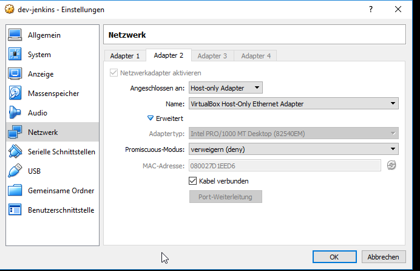

# General

# Setup

<https://funnelgarden.com/sonarqube-jenkins-docker/>

Follow the steps described in <https://github.com/galexandre/docker-jenkins-sonarqube>

# Setup Sonar

* <https://funnelgarden.com/sonarqube-jenkins-docker/>

A docker-compose example with sonarqube and postgres:
* <https://github.com/SonarSource/docker-sonarqube/blob/master/recipes/docker-compose-postgres-example.yml>
* <https://hub.docker.com/r/bitnami/sonarqube>

# Connect from Host System

(<https://www.thomas-krenn.com/de/wiki/Netzwerkkonfiguration_in_VirtualBox#Bridged_networking>)

The Sonar Server can be accessed with `http://192.168.56.101:9000`

Maven  
~~~
mvn clean install sonar:sonar -Dsonar.projectKey=myProjectKey  -Dsonar.host.url=http://192.168.56.101:9000
~~~

# References

* <https://funnelgarden.com/sonarqube-jenkins-docker/>
* <https://github.com/galexandre/docker-jenkins-sonarqube>