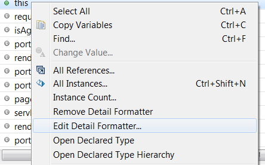
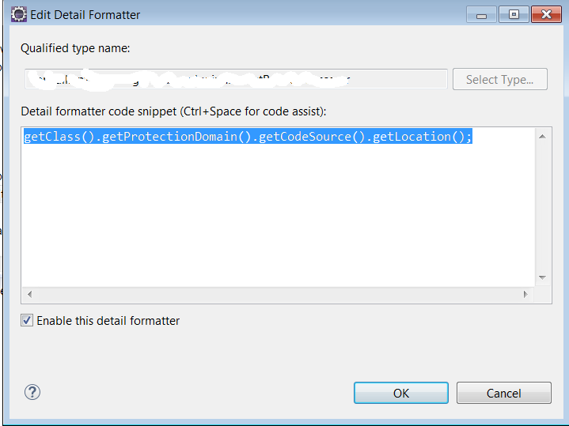

This can be done by changing the detail formatter of the class to
~~~java
getClass().getProtectionDomain().getCodeSource().getLocation(); 
~~~

In the variables view of the debug perspective open the context menu:

Set the detail formatter

{: .danger title="Tip"}
Do not forget to reset the detail formatter afterwards

# References
* <http://henryranch.net/tutorials/how-to-determine-where-a-java-class-is-being-loaded-from/>
