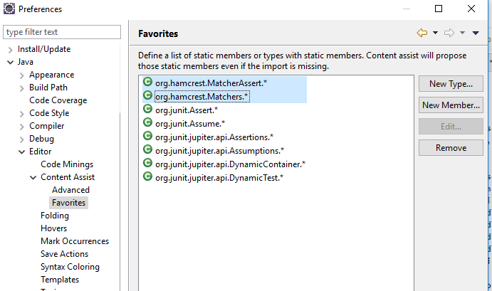

# Java Settings 

## Content Assist Favorites

### Hamcrest Matchers

* org.hamcrest.MatcherAssert
* org.hamcrest.Matchers
  

# Java Code Templates

## Private Util Class Constructor

~~~java
private ${enclosing_type}() {
    throw new AssertionError("No ${enclosing_type} instances for you!");
}
~~~

## Test Method for JUnit Jupiter
In order to give each test method a recognizable structure, we define the following sections:
* Description: Short description of the test case if necessary
* Setup
* Exercise
* Verify

See also <http://xunitpatterns.com/Four%20Phase%20Test.html>

{: .code title="test method (JUnit Jupiter)"}
~~~java
@${testType:newType(org.junit.jupiter.api.Test)}
void ${testName}() {
    ${staticImport:importStatic('org.junit.jupiter.api.Assertions.*')}
    // Description
    ${cursor}
    // Setup

    // Exercise

    // Verify
}
~~~