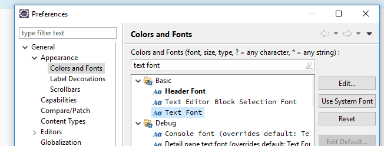

# Plugins

## Databse
Universal database tool: <https://dbeaver.io/>  
Marketplace: <https://marketplace.eclipse.org/content/dbeaver>

## Markdown

<https://marketplace.eclipse.org/content/fluentmark>

### Pandoc

* Install pandoc from <https://pandoc.org>

(Preview does not work with umlauts?)

# Theme: Clean Sheet

> An ergonomic theme for the Eclipse Java IDE on Windows 10 and Mac OS X.    
<https://marketplace.eclipse.org/content/clean-sheet>

## Variant for Linux Systems

Clean Sheet does not work on linux systems. Workaround can be:

* Install Source Code Pro (see below)
* Create a  eclipse theme (<http://blog.vogella.com/2012/07/11/eclipse-4-is-beautiful-create-your-own-eclipse-4-theme/>) with css similar to clen sheet
* Place the plugin in the `dropins` folder

 
 The theme files are like:
 
 {: .code .x title="plugin.xml"}
~~~xml
?xml version="1.0" encoding="UTF-8"?>
<?eclipse version="3.4"?>
<plugin>
   <extension
         point="org.eclipse.e4.ui.css.swt.theme">
         <theme
            basestylesheeturi="css/myTheme.css"
            id="my.theme.id"
            label="myThemeName">
      </theme>
   </extension>
</plugin>
~~~

{: .code .x title="build.properties"}
~~~
source.. = src/
output.. = bin/
bin.includes = META-INF/,\
               .,\
               plugin.xml,\
               css/
src.includes = css/
~~~

{: .code .x title="MANIFEST.MF"}
~~~
Manifest-Version: 1.0
Bundle-ManifestVersion: 2
Bundle-Name: Theme
Bundle-SymbolicName: my.theme;singleton:=true
Bundle-Version: 1.0.0.qualifier
Automatic-Module-Name: my.theme
Bundle-RequiredExecutionEnvironment: JavaSE-1.8
Require-Bundle: org.eclipse.e4.ui.css.swt.theme
~~~
 
css like `clean-sheet.css` in <https://github.com/fappel/xiliary/tree/master/com.codeaffine.eclipse.ui.swt.theme/css>
 

# Font:  Source Code Pro

Note: is used by Clean Sheet theme, but can also be installed without Clean Sheet theme (for instance in a linux environment).

> Source Code Pro is a set of monospaced OpenType fonts that have been designed to work well in coding environments.    

<https://github.com/adobe-fonts/source-code-pro>

<https://fonts.google.com/specimen/Source+Code+Pro>

In the Eclipse preferences select the section: "General" -> "Appearance" ->"Color and Fonts"  
and there the element: "Basic" -> "Text Font"

