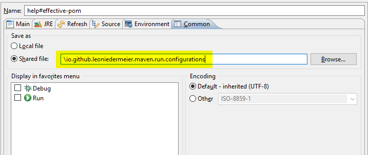

Create run configurations for maven goals and save them.

* Base directory: `${project_loc}`: launch configuration executed in the root directory of the current (selected/active) project.

### Save Run Configurations in a Project
The run configurations can be saved. 

    