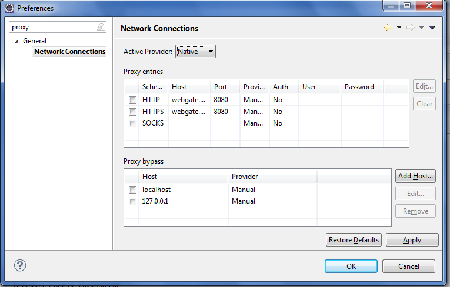

# Übersicht

In Eclipse kann man den Proxy über die Preferences \-> General \-> Network Connections einstellen. 
Üblicherweise hat man die Auswahlmöglichkeit zwischen

* Direct
* Manual
* Native

"Native" greift auf die Systemeinstellungen für den Proxy zurück. Das ist normalerweise nicht die Einstellung vom Internet Explorer oder Firefox. Es wäre also schön, wenn man auf die IE oder Firefox Einstellungen zurückgreifen kann. Ferner werden Proxy-Einstellungen oft über pac-Skripte gemacht. Auch diese sollten ausgewertet werden können.

{:height="300px"}

# Umsetzung

Der "native" ProxyProvider wird im Konstruktor von `org.eclipse.core.internal.net.ProxyManager` per Reflection erzeugt:

~~~java
private ProxyManager() {
      try {
            nativeProxyProvider = (AbstractProxyProvider) Class.forName("org.eclipse.core.net.ProxyProvider").newInstance(); //$NON-NLS-1$

        } catch (ClassNotFoundException e) {
            // no class found
        } catch (Exception e) {
            Activator.logInfo("Problems occured during the proxy provider initialization.", e); //$NON-NLS-1$
        }
    }
~~~

Man sollte also eine passende Klasse `org.eclipse.core.net.ProxyProvider` bereitstellen. 
Die Klasse `ProxyManager` befindet sich im Bundle `org.eclipse.core.net`. 
Damit unsere Klasse `org.eclipse.core.net.ProxyProvider` per Reflection erzeugt werden kann, 
bauen wir ein Fragment zum Bundle `org.eclipse.core.net`.

**MANIFEST.MF**
~~~
Manifest-Version: 1.0
Fragment-Host: org.eclipse.core.net
Bundle-Version: 1.0.0
Bundle-Name: NativeProxy
Bundle-ManifestVersion: 2
Bundle-SymbolicName: NativeProxy;singleton:=true
Bundle-RequiredExecutionEnvironment: JavaSE-1.6
~~~

Man benötigt nun noch eine Bibliothek, welche die Internet Explorer und Firefox Proxy Einstellungen auslesen kann 
und am besten auch noch pac Skripte auswerten kann. 
Proxy Vole ( <http://code.google.com/p/proxy-vole/> bzw. <https://github.com/MarkusBernhardt/proxy-vole> ) 
stellt solche Funktionen zur Verfügung:

> A Java library to auto detect the platform network proxy settings. 
The library provides some proxy setting search strategies to read the proxy settings from the system config 
(Windows, KDE, Gnome, OSX), browser config (Firefox, IE), or environment variables, ... 
and provides you an ready to use proxy selector.

Nun muss man nur noch die Klasse implementieren. Das kann so aussehen:

~~~java
package org.eclipse.core.net;
import java.net.InetSocketAddress;
import java.net.Proxy;
import java.net.ProxySelector;
import java.net.SocketAddress;
import java.net.URI;
import java.util.ArrayList;
import java.util.List;
import org.eclipse.core.internal.net.AbstractProxyProvider;
import org.eclipse.core.internal.net.Activator;
import org.eclipse.core.internal.net.ProxyData;
import org.eclipse.core.net.proxy.IProxyData;
import com.btr.proxy.search.ProxySearch;
import com.btr.proxy.search.ProxySearch.Strategy;
import com.btr.proxy.util.PlatformUtil;
import com.btr.proxy.util.PlatformUtil.Platform;
public class ProxyProvider extends AbstractProxyProvider
{

  private ProxySelector proxySelector;

  private volatile boolean initialized = false;

public ProxyProvider() {
    super();
  }

  private synchronized void init() {
    if (this.initialized) {
      return;
    }
    try {
      final ProxySearch proxySearch = new ProxySearch();
      if (PlatformUtil.getCurrentPlattform() == Platform.WIN) {
        proxySearch.addStrategy(Strategy.FIREFOX);
        proxySearch.addStrategy(Strategy.IE);
        proxySearch.addStrategy(Strategy.JAVA);
        proxySearch.addStrategy(Strategy.OS_DEFAULT);
      }
      this.proxySelector = proxySearch.getProxySelector();
    }
    catch (final Exception e) {
      ...
    }
    this.initialized = true;
  }

  @Override
  protected String[] getNonProxiedHosts() {
    return new String[] {};
  }

  @Override
  protected IProxyData[] getProxyData() {
    return new IProxyData[] {};
  }

  @Override
  protected IProxyData[] getProxyData(final URI uri) {
    init();
    if (this.proxySelector == null) {
      return null;
    }

    final List<Proxy> select = this.proxySelector.select(uri);
    final ArrayList<IProxyData> datas = new ArrayList<IProxyData>();
    if (select == null || select.size() == 0) {
      return null;
    }
    for (final Proxy proxy : select) {
      final SocketAddress address = proxy.address();
      if (address instanceof InetSocketAddress) {
        final ProxyData data = new ProxyData(proxy.type().name(), ((InetSocketAddress) address).getHostName(),
            ((InetSocketAddress) address).getPort(), false, "");
        datas.add(data);
      }
    }
    return datas.toArray(new IProxyData[datas.size()]);
  }
}
~~~

In der init Methode werden die Suchstrategien für die Proxyeinstellungen definiert.
In der `getProxyData` Methode wird für eine URL ein passender Proxy gesucht. 
Hierbei liefert ein über `com.btr.proxy.search.ProxySearch` konfigurierter `java.net.ProxySelector` den passenden 
Proxy (oder keinen).

**MANIFEST.MF**
~~~
Eclipse-BundleShape: dir
Bundle-ClassPath: proxy-vole_20111102.jar,library.jar
~~~

{: .info title=Hinweis}
proxy-vole benutzt auch native Libraries. Diese werden bei Bedarf mit `com.btr.proxy.search.desktop.win.DLLManager` 
in ein temporäres Verzeichnis kopiert.

h1. Referenzen

* <http://code.google.com/p/proxy-vole/>
* <https://github.com/MarkusBernhardt/proxy-vole>
* <https://bugs.eclipse.org/bugs/show_bug.cgi?id=257443>
* <http://grepcode.com/file/repository.grepcode.com$java$eclipse.org$4.2.2@org.eclipse.scout$net@3.8.2@org$eclipse$scout$net$EclipseProxySelector.java>
