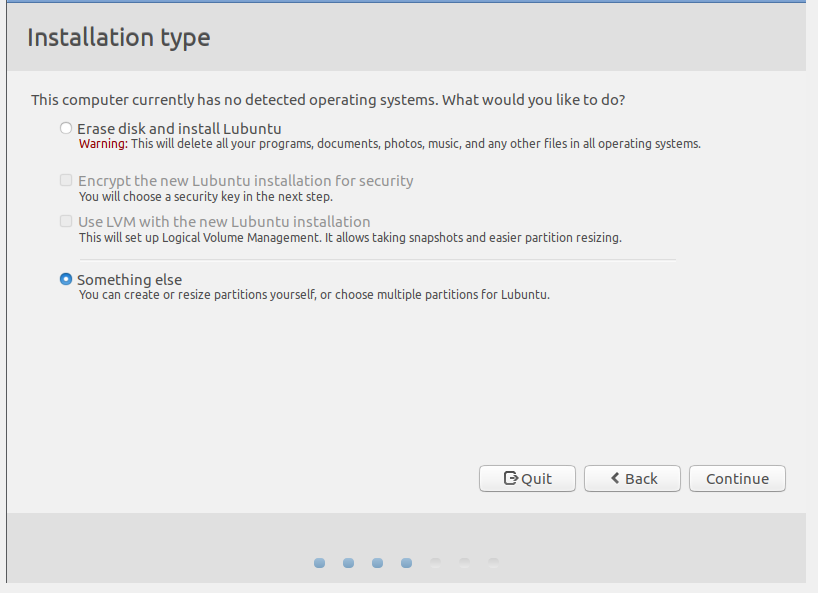
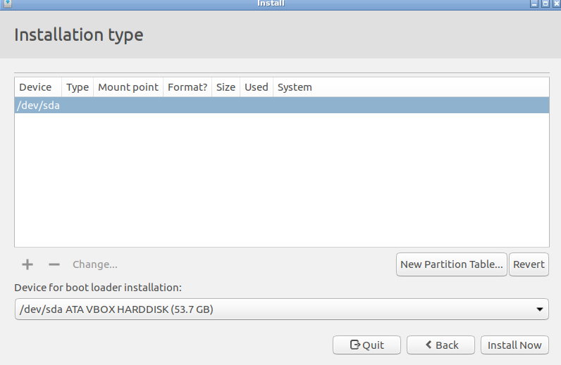
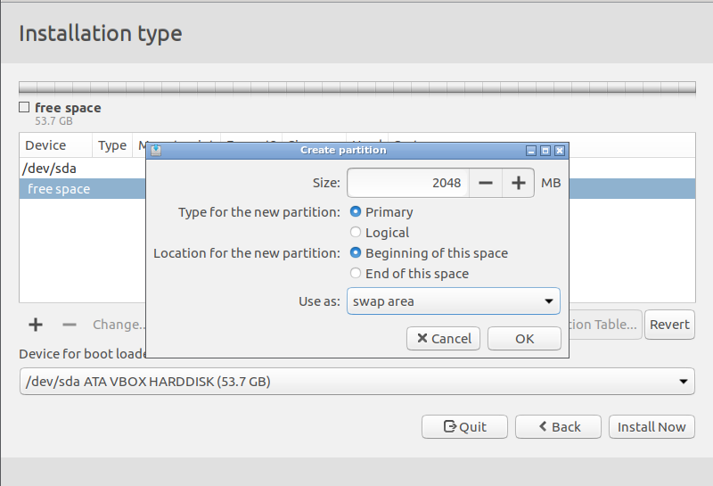
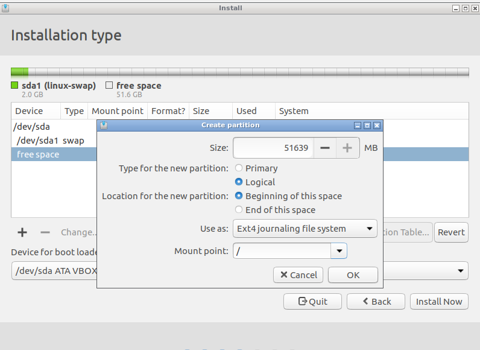
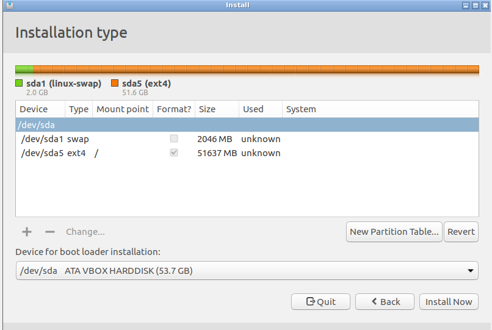
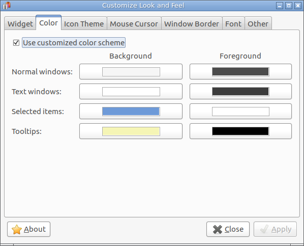
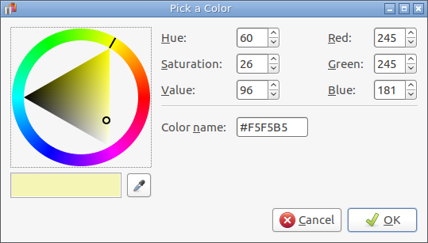

# General

## VirtualBox

Using a **dynamically allocated image** does **NOT** mean that the file system size of the guest system grows dynamically. It means that the image file will be grow on demand. Therefore select a appropriate size of the guest file system. 

> This will initially be very small and not occupy any space for unused virtual disk sectors, but will grow every time a disk sector is written  
(https://www.virtualbox.org/manual/ch05.html) 

## Installing Lubuntu

<http://lubuntu.net/>

We do not use the default partitioning. If the swap partition is left of the root partition, it is easier to grow the root partition. Resizing the size of a VirtualBox disk needs two steps

1. Resize the VirtualBox disk in the host
2. Resize the partitions in the guest

See for instance <http://derekmolloy.ie/resize-a-virtualbox-disk/>

## Installing Guest Additions
 
 Required packages:
 
* make
* gcc

# Tweaks

## Set a Theme

{: .success title="Themes"}
A Windows 10 like theme:
<http://b00merang.weebly.com/windows-10-transformation-pack.html>

Download the files and copy the theme to `~/themes` and the icons to `~/.icons`

## Set Tooltip Color of Eclipse

Per default the tooltips in eclipse are black. This is not very readable. In order to change this, do the following:

Create a `eclipse.sh` file

~~~bash
#!/bin/bash
export UBUNTU_MENUPROXY=0
export SWT_GTK3=0
/home/lubuntu/bin/eclipse/eclipse
~~~

Depending on the theme the ToolTips background color should be customized:

Select a color like:

## Add Eclipse to Desktop

Create a `~/.local/share/applications/eclipse.desktop` file:

~~~
[Desktop Entry]
Name=Eclipse
Type=Application
Exec=/home/lubuntu/bin/eclipse/eclipse.sh
Terminal=false
Icon=/home/lubuntu/bin/eclipse/icon.xpm
Comment=Integrated Development Environment
NoDisplay=false
Categories=Development;IDE;
Name[en]=Eclipse
~~~

The `Exec` path is to the `eclipse.sh` file mentioned above.

## Change Key Shortcut F11

Eclipse binds the key F11 to "Debug the selected resource or active editor". Lubuntu binds F11 to "Toggle Fullscreen". In order to change comment out the `action` associated with F11 in the file `~/.config/openbox/lubuntu-rc.xml`

~~~
<keybind key="F11">
  <!-- <action name="ToggleFullscreen"/> -->
</keybind>
~~~

Then reconfigure the openbox window manager by executing the following shell command

~~~bash
openbox --reconfigure
~~~

Same can be done with Ctrl+F11 (Run the selected resource or active editor) (lubuntu: "C-F11")

see <http://askubuntu.com/questions/354664/how-do-i-actually-disable-f11-fullscreen-on-lubuntu-13-04>

## Slow Boot of Lubuntu

A slow boot can have different causes. One can be that the swap mount takes a long time. This seems to be caused by invalid uuid entries in `/etc/fstab`. To check this, execute a `ls -al /dev/disk/by-uuid/` and compare it with  `/etc/fstab` entries.

Example:

~~~bash
dev@dev-box:~$ ls -al /dev/disk/by-uuid/
total 0
drwxr-xr-x 2 root root 100 Mär 15 19:46 .
drwxr-xr-x 7 root root 140 Mär 15 19:46 ..
lrwxrwxrwx 1 root root   9 Mär 15 19:46 2017-03-08-15-05-51-00 -> ../../sr0
lrwxrwxrwx 1 root root  10 Mär 15 19:46 834ae6f0-0a33-4542-a717-0120299a97f5 -> ../../sda1
lrwxrwxrwx 1 root root  10 Mär 15 19:46 e39c41f4-6196-45bf-8cd9-0a98c67094de -> ../../sda5
dev@dev-box:~$ 
~~~

The  `/etc/fstab`
~~~
# /etc/fstab: static file system information.
#
# Use 'blkid' to print the universally unique identifier for a
# device; this may be used with UUID= as a more robust way to name devices
# that works even if disks are added and removed. See fstab(5).
#
# <file system> <mount point>   <type>  <options>       <dump>  <pass>
# / was on /dev/sda5 during installation
UUID=e39c41f4-6196-45bf-8cd9-0a98c67094de /               ext4    errors=remount-ro 0       1
# swap was on /dev/sda1 during installation
UUID=834ae6f0-0a33-4542-a717-000000000000 none            swap    sw              0       0
~~~

If the uuids are different (as in our example for `/dev/sda1`), 

* open an editor with  `sudo leafpad /etc/fstab`, change the value and save it
* Maybe execute : `sudo swapoff -a` and `sudo swapon -a` 
